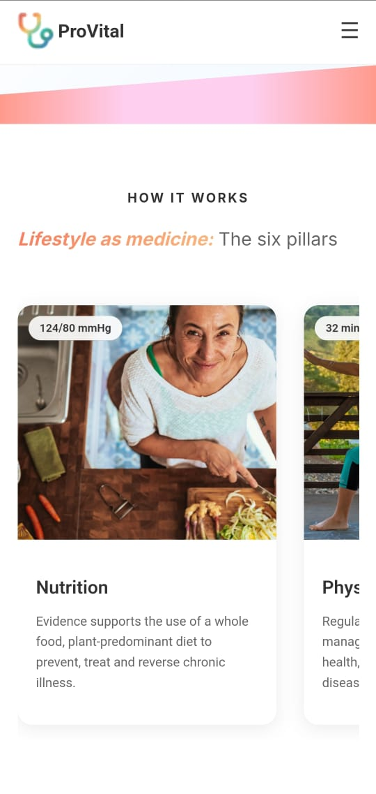

# 🩺 Provital

**Provital** is a modern web application that allows users to book appointments with **lifestyle medicine experts**. Built with React and designed for future deployment on **GitHub Pages**, it offers a clean user interface and smooth animations.

---

## 🚀 Features

- ✨ **Hero Section** with animated images (two columns with looping top-to-bottom and bottom-to-top motion).
- 🔎 **Search Bar** to find lifestyle medicine experts.
- 📖 **How It Works** section to guide users through the booking process.
- 📱 **Responsive Design** for mobile and desktop devices.

---

## 📁 Project Structure

```
provital/
└── provital-frontend/        # React application
    ├── public/               # Static files (index.html)
    ├── src/                  # Components, styles, and assets
    └── package.json          # Project config and dependencies
```

---

## 🖼️ Screenshots

### 💻 Desktop Version


### 📱 Mobile Version

<p align="center">
  
  
</p>

---

## 🎥 Demo Video

Watch a demo of the Provital app:  

https://github.com/user-attachments/assets/e02bbebc-856d-410f-a054-ac38489e30ac

---

## 🛠️ Prerequisites

Ensure you have the following installed:

- **Node.js**: Version 20 or higher
- **npm**: Comes with Node.js

Check your versions:

```bash
node -v
npm -v
```

Install Node.js 20 with `nvm` if needed:

```bash
nvm install 20
nvm use 20
```

---

## ⚙️ Setup Instructions

1. **Clone the Repository**
   ```bash
   git clone https://github.com/roshangomes/provital.git
   cd provital
   ```

2. **Navigate to the Frontend Folder**
   ```bash
   cd provital-frontend
   ```

3. **Install Dependencies**
   ```bash
   npm install
   ```

4. **Run the App Locally**
   ```bash
   npm start
   ```

   Open [http://localhost:3000](http://localhost:3000) to view the app in your browser.

---

## 🧰 Troubleshooting

- ❌ **Missing Images**: Ensure the `src/assets/` folder contains the required images:  
  `Rectangle1.png` through `Rectangle8.png`.  
  These are used in the animated hero section. Without them, rendering may break.

- ⚠️ **Port Conflict**: If `localhost:3000` is already in use:
  ```bash
  PORT=3001 npm start
  ```

- 🔄 **React Version Issues**:  
  The app uses `React 18.3.1` (downgraded from `19.1.0` for compatibility with `react-scripts@5.0.1`).  
  Make sure `package.json` includes:

  ```json
  "dependencies": {
    "react": "^18.3.1",
    "react-dom": "^18.3.1",
    ...
  }
  ```

---

## 🤝 Contributing

We welcome contributions! Here’s how you can help:

1. **Fork** the repository  
2. **Create a branch** for your feature:
   ```bash
   git checkout -b feature/your-feature-name
   ```
3. **Commit** your changes:
   ```bash
   git commit -m "Add your feature"
   ```
4. **Push** your changes:
   ```bash
   git push origin feature/your-feature-name
   ```
5. **Open a Pull Request** on GitHub

---

## 📄 License

This project is licensed under the [MIT License](LICENSE).

---

## 📬 Contact

For questions or feedback, reach out to **[roshangomes](https://github.com/roshangomes)**.

---

_Last updated: June 19, 2025_
